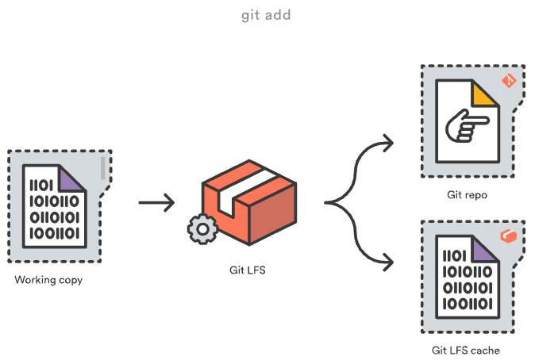
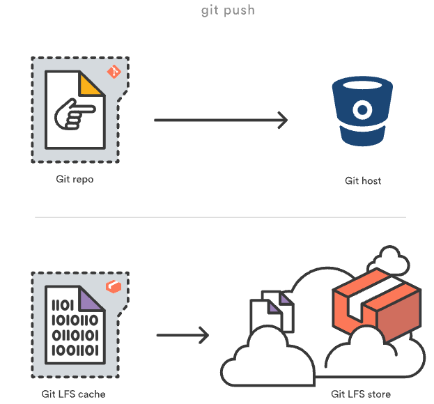
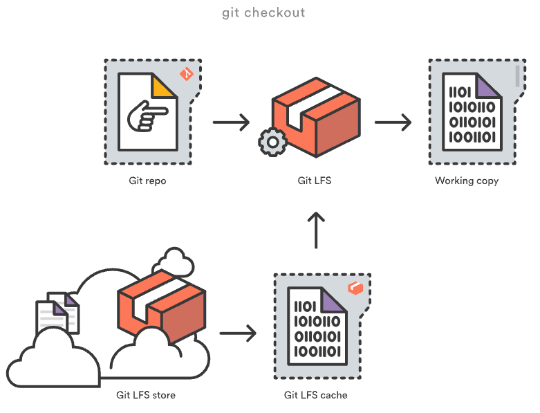
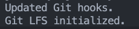

这里记录学习大模型的相关知识

## git lfs

git lfs - `git large file storage`

### Git lfs是什么

Git是一个分布式版本控制系统，在clone过程中，整个项目的历史记录都会传输到客户端。对于包含大文件的项目，尤其是经常修改的大文件，初始clone可能需要大量时间，因为客户端必须下载文件的每个版本。 所以为了解决这个问题，出现了Git LFS。

- Git LFS（Large File Storage）是 Git 的一个扩展,旨在解决 Git 处理大文件时遇到的问题。它由 Atlassian 公司开发,于 2015 年推出。
- Git LFS 的核心思想是将大文件存储在独立的远程服务器上,而不是直接存储在 Git 仓库中。在 Git 仓库中,只保留一个指向实际文件的指针,称为 LFS 指针。
- 当用户在本地进行 Git 操作时,如提交、推送或拉取,Git LFS 会拦截这些操作,并将实际的大文件上传或下载到远程 LFS 服务器,而 Git 仓库中只处理 LFS 指针。
- 通过这种方式,Git LFS 可以显著减小 Git 仓库的大小,加快克隆和拉取的速度,同时还能保持 Git 的分布式特性和版本控制功能。

在Git的正常使用过程中，用户不会并不会看到指针文件，它们由Git LFS自动处理:  

1.当文件add到repo时，Git LFS会用指针替换其内容，并将文件内容存储在本地Git LFS缓存中  

 

2.当将commit推送到远程仓库时，commit引用的Git LFS文件都从本地的Git LFS缓存中上传到与Git仓库绑定的远程Git LFS存储中  

 

3.当checkout包含Git LFS指针的提交时，指针文件将替换为本地Git LFS缓存中的文件，或者从远端Git LFS存储下载

 

指针文件相当于是大文件在git的一个映射，具体的内容是:  

```text
version https://git-lfs.github.com/spec/v1
oid sha256:5b62e134d2478ae0bbded57f6be8f048d8d916cb876f0656a8a6d1363716d999
size 285
```

Git LFS是可以无缝加入Git的，平常使用是无感的，不影响这张的add push pull checkout等操作


### 安装和使用

1.MAC安装

```bash
brew install git-lfs
```

2.Git LFS init

```bash 
git lfs install
```
初始化成功:  

 

3.在每个Git repo中如果你想要通过Git LFS管理大文件，需要选择一个文件类型由其管理  

```bash
git lfs track "*.psd"
```

执行完之后，会在repo中生成一个`.gitattributes`文件，里面会添加需要管理的文件类型  

```text
*.psd filter=lfs diff=lfs merge=lfs -text
```

note: Git LFS不会自动管理预先存在的文件，因此可能需要通过`git lfs migrate`命令将这些文件迁移到Git LFS

4.创建文件并提交到git

```bash
touch test.psd
git add test.psd
git commit -m "add test.psd"
git push origin main
```

5.设置阈值

通过上面的命令并没有将文件替换为指针，估计是文件太小，所以调整下阈值测试下，先改为5MB  

```bash
git config --global lfs.threshold 5MB
git config lfs.threshold 5MB
git config lfs.threshold
git lfs track "*.parquet"
```

再次查看确实生效了:  

```
git lfs ls-files
```

 

再看下github页面显示:  

 


查看指针文件信息:  

```bash
git show HEAD:data/train-00000-of-00001.parquet
```

在本地目录你看到的就是实际的文件，但是实际上git存储的是指针文件  

实际文件:  

 

指针文件:  

 


### 参考资料

[Git LFS Atlassian说明](https://www.atlassian.com/git/tutorials/git-lfs)  
[Git LFS官方网站](https://git-lfs.com/)  
[知乎](https://zhuanlan.zhihu.com/p/690634358)  
[csdn](https://blog.csdn.net/xiaojia1001/article/details/140616622)  